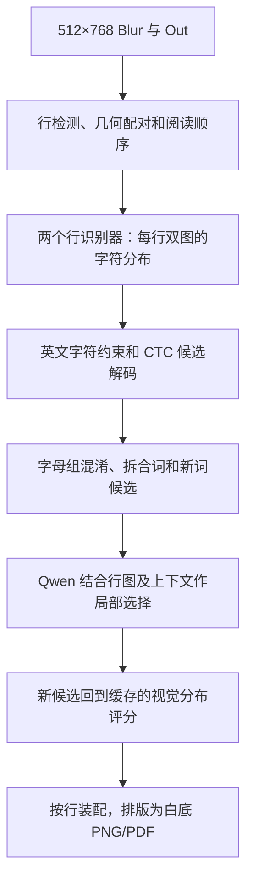

# Stage 2 v2：视觉字符证据驱动的英文恢复

状态：2026-09-23 已实现三个入口并完成 CPU 合同检查；尚未进行 H200 上的新模型推理。默认视觉模型为 PP-OCRv6 medium。用户确认保留 A–Z/a–z、0–9、标点和空白，仅在单词内部判断 1/l、0/O 等混淆。以下保留设计依据；实际部署使用 JUPYTER.md 的命令。

目标是从可能为 gibberish 的视觉识别结果出发，逐步产生字符、词、短语候选，再恢复为可阅读的 512×768 白底文字页。Qwen 保留 8B/32B 切换，默认使用已有 32B。base deblur 不需改动。

## 架构决策

主数据从“一段 OCR 字符串”改成“实际文字行 + 各字母的视觉候选 + 几何位置”。Qwen 负责局部语言选择和有限新词提议；图像证据、字符限制、候选评分、最终装配由程序掌握。



这是视觉识别主导的分阶段系统。字符分布和词候选都被保留到需要做决定的位置，避免过早只留下一个错误单词。每条文字行都进入处理流程；清晰位置可保持原读法，困难位置可生成新候选，不把“已有 OCR 必须至少有一路正确”作为前提。

对现有 `docsity_32b_local.jsonl` 的统计：157 个区域共 268111 个字母字符，其中 267901 个已经是 ASCII 英文字母，另有 2370 个数字。这个统计不是识别准确率；它说明限制字母表能清理字符范围，却不足以解决现有伪英文。真正的改造重点是视觉候选、错误模型和上下文联合选择。

## 字符范围是程序规则

正文默认允许：

- 26 个英文字母的大小写形态，即 `A-Z` 和 `a-z`。
- 数字 `0-9`，保留年份、页码、引用编号等。
- 空格、排版换行，以及配置中列举的常见标点。
- 弯引号、破折号等可做明确的显示归一化；转换留痕。

正文字符限制不适用于 JSON 的结构字段。原始识别记录可以保留任何字符用于诊断，进入新正文的候选必须符合允许集。无效字符不能靠静默删除处理，否则可能把两个词接成一个词。单词内的 `1/l/I`、`0/O` 产生多个候选，由字形和上下文决定，不全文替换数字。

第一处约束在 CTC 解码：从当前权重自己的字典建立原索引映射，只允许指定类别参与解码，同时保留 CTC blank 和普通空格。blank 是对齐符号，不是空格；不修改模型字典或分类头。

第二处约束在候选生成：词表、字符编辑和 Qwen 提议都经过同一校验。第三处在最终装配：不符合合同的候选不能直接进入输出页。Qwen 使用子词/字节 token，不能通过“只允许 26 个 token”来等价实现字符限制。

发布的 `en_PP-OCRv5_mobile_rec` 字典实际上也含重音拉丁字母、希腊字母和大量符号，英文模型名称不能替代这一约束。[实际发布配置](https://huggingface.co/PaddlePaddle/en_PP-OCRv5_mobile_rec/raw/main/inference.yml)。

## 视觉前端：先取得可靠的行与字符证据

继续使用现有 157 对已经对齐的 Blur/Out，保持实际样本 ID。512×768 表示当前可用区域，不保证是原 PDF 的完整页面。六块真正相邻的 256×256 图在识别前拼合；原来横跨切块的词在同一行里分析。放大单个切块不能替代这些上下文。

检测器采用 `PP-OCRv6_medium_det`。先建立统一行多边形、所属列与阅读顺序，再对 Blur/Out 使用同一裁剪和变换。检测框可能是半行、多行或跨栏，必须处理几何关系；不能只按检测数组的序号配对。Out 提供版面线索，Blur 可补充漏检；无框不等于无字。检测覆盖与疑似漏行单独记录。

首版主识别器为 `PP-OCRv6_medium_rec`，英文互补识别器为 `en_PP-OCRv5_mobile_rec`，共用一个 Paddle 环境。每行得到两个识别器 × Blur/Out 的最多四份证据。保持原始灰度信息和动态宽度；不默认将退化文字强二值化，不将整页挤进行识别器。SVTRv2 后续可按相同合同替换识别器，首轮不增加第三套后端。

v6 已随 PaddleOCR 3.7.0 正式发布，推理仍走 CTC 分支，兼容本架构的字符分布与候选评分接口。作者内部印刷英文评测优于 v5 server，可作为选型依据，但没有证明它在本项目的伪字 Out 上最好。英文 v5 作为另一种候选来源，两路错误可能相关，不能把一致意见当作独立验证。[发布记录](https://github.com/PaddlePaddle/PaddleOCR/releases/tag/v3.7.0)、[技术报告](https://arxiv.org/html/2606.13108v1)。

当前公开配置支持动态行宽；首版不强制压成 48×320。v6 官方训练示例的 `max_text_length=25` 是训练标签设置，不是推理的固有上限，后续长行微调必须同时修改长度与训练尺寸。[训练配置](https://github.com/PaddlePaddle/PaddleOCR/blob/v3.7.0/configs/rec/PP-OCRv6/PP-OCRv6_medium_rec.yml)。

视觉接口至少保存：

```text
line_id, page_id, polygon, reading_order, crop_to_page
recognizer, model_revision, view=blur|out
crop_shape, resized_content_width, canvas_width, T
alphabet_hash, original_class_ids, blank_id
raw_text, restricted_text, probabilities_ref
```

概率在识别器 argmax 前取得，形状是 `[T, C]`；当前公开高层 Paddle API 没有直接返回原始概率的开关。需将锁版本的 PaddleX 适配集中在 `paddle_ctc.py`：在 runner 输出后、官方 postprocessor 解码前捕获，显式绑定行 ID 与图片。禁止依赖全局“最后一次概率”缓冲区，避免结果串行。

只长期保存允许类别的原始 float32 概率、blank、每步排除类别总概率和原始解码，写入压缩 NPZ；元数据写 JSONL。这样既保留全部合法字母的再评分能力，也避免把 server 的大型多语矩阵一直留在内存或 JSON 中。字典 hash 与矩阵维度必须对应。

字母限制只用于约束解码，视觉评分使用原分布里的原始值。把剩余英文字母重新归一化会掩盖“模型原本几乎不支持英文”的事实；分数不能被解释成正确概率。已 softmax 的输出也不能再 softmax 一次。[PaddleX 实际推理入口](https://github.com/PaddlePaddle/PaddleX/blob/v3.7.0/paddlex/inference/models/text_recognition/predictor.py)、[后处理](https://github.com/PaddlePaddle/PaddleX/blob/v3.7.0/paddlex/inference/models/text_recognition/processors.py)。

第一版逐行或按相近宽度分组，记录画布与 padding。不要凭 `T × valid_ratio` 随意裁掉概率尾部，也不要假设所有识别器都有相同下采样比例。CTC 时间步可以帮助定位疑点，但不是精确字母框；给 Qwen 的目标图仍保留完整行或含邻字的短片段。

## 字符到单词：新增有依据的候选

`ctc.py` 提供受限 greedy/小束解码，以及指定候选的完整 CTC 路径评分。字符分布中尚未胜出的字母可以进入备选，而不必只有原 top-1 串。beam 用于限制搜索规模，不进行 26 的 N 次方枚举。

`candidates.py` 在这些视觉候选上增加：

1. 字符及字符组混淆：如 `rn↔m`、`cl↔d`，并允许字母增删。
2. 词边界修改：漏空格、多余空格、行尾连字符、被切开的词。
3. 英文近邻词、词形、原始字符串、专名及缩写；词表外字符串仍是合法候选。
4. 有限的 Qwen 局部新词提议，允许超过原始 OCR 的候选范围。

可用 symspellpy 做普通词表召回，再用小型字符组混淆和加权编辑排序。它只是召回工具，不能将其最近词或最高频词直接当答案。不能先验锁死最多修改 1–2 个字母；但候选规模保持有限，后续基于真实错字再扩展搜索。[字符组错误模型](https://aclanthology.org/P00-1037.pdf)、[噪声 OCR 与上下文纠正](https://www.projectcomputing.com/resources/CorrectingNoisyOCR.pdf)。

每处修改锚定原行的字符区间，允许一个候选含多个词；相邻编辑合并，避免先按错误空格切词。字符区间是源字符串偏移，不冒充精确像素框。不同模型的 token、字符串偏移和图片坐标不能混作同一种索引。

## Qwen 的职责与视觉再评分

Qwen 每次接收目标行的 Blur/Out 两张图、多个局部候选、字符混淆摘要，以及分离的相邻行原始 OCR 上下文。上下文帮助辨词，不用于生成目标外正文；不传 Clear 或测试 GT。第一版保持两张目标图，复用现有 processor/encode 接口。

现有候选在送入 Qwen 前已有各路 CTC 分数与编辑记录。Qwen 一次返回该行各分歧的选择 ID，必要时对指定片段提出简短新读法。它不输出自由全文，不通过自己声称“有信心”获得高视觉分数。新增读法要经过字符范围、区间与长度检查，再写回完整候选行做 CTC 再评分。只有出现新提议时，才允许追加一次带更新证据的短复选；不构建不断自问自答的代理循环。

CTC forward 动态规划可以在缓存的概率上计算完整候选行的视觉支持；CPU 即可完成，不需重新加载 OCR 模型。使用 log-domain float32 算法，处理 blank、重复字符与不可能对齐；不能把真实零概率用大 epsilon 变成可行。分数仅表示该识别器对该图的支持程度。[CTC 原论文](https://www.cs.toronto.edu/~graves/icml_2006.pdf)。

**不要求新词在每一路 CTC 上都胜过原始串。** Out 已经画错的字可能得到最高视觉分；这个门槛会将系统锁在 gibberish。各路证据分别记录、保留其较有支持的候选，并结合字符编辑与短语语境比较。Blur 支持的读法不能被 Out 一票否决；两个模型一致也不等于正确。

硬校验主要处理不合法字符、越界修改、重复 span、格式错误。某一来源不能完成 CTC 对齐时，该来源标为不可评分，不能否决其他来源；所有可用来源均不可能对齐的提议不能成为有视觉支持的候选，可另存为语言推测。视觉强弱、编辑代价和语言搭配属于可比较的软证据。首版不虚构一个通用 CTC 阈值来宣布“已核验”；视觉弱但上下文支持的读法可作为最佳推测保留，原串与改动依据写在记录里。不给 PDF 塞满说明，也不把英语流畅度等同原文恢复。

## 排版与交付

`render.py` 仅消费最后选定的行文字、位置与样本 ID，使用字体排版，不调用语言模型或图像生成模型。正文进入排版前通过字符合同检查。

- `recovered/*.png`：512×768 白底黑字页，尽量保持原行位置、段落与列。
- `recovered.pdf`：相同布局，文字作为可选择和复制的 PDF 文本对象写入。
- `comparison.pdf`：同一样本的 Clear / Output / Blur / Recovered 四列演示。Clear 通过仅供 renderer 使用的独立参考清单读取，避免进入恢复推理。
- `recovery.jsonl`：原文串、候选、所选词、各路证据与修改位置。

不必切回六个 256×256 小块。原参考 PDF 是旧 2 号，现有恢复批次是 4/14；新演示使用真实匹配样本，借用版式而不混贴不同文档。512×768 是 PNG 像素与布局坐标，PDF 物理尺寸可按相同比例设置。

按每行的框估计字号与基线，尽量避免重新换行串到邻行。字体宽度与原图不完全一致时允许适度调整；溢出需可见地记录，不能悄悄裁掉末尾字符。PDF 和 PNG 从同一排版记录生成，确保两份内容一致。

## 代码划分与迁移

仅设三个面向运行的入口，算法和版本适配放在少量辅助文件：

| 文件 | 职责 |
| --- | --- |
| `ocr_lines.py`，新入口 | 检测行、共同裁图、调用两个识别器、写视觉缓存 |
| `paddle_ctc.py`，新辅助 | 唯一依赖 PaddleX 内部接口的适配层，取得原始概率和几何元数据 |
| `ctc.py`，新辅助 | 字符允许集、解码、完整候选行的 CTC 评分；不依赖 GPU |
| `candidates.py`，新辅助 | 多字符混淆、拆合词、词表候选、原字符串偏移 |
| `recover.py`，新入口 | 调用已有 Qwen、候选补充/选择、程序核对与结果装配 |
| `render.py`，新入口 | 512×768 PNG、可复制 PDF、四列演示 |
| `common.py`，保留并小改 | 数据清单、图像 hash、配置、阶段缓存与模型型号选择 |

复用 `prepare.py` 的输入配准/导入、`common.py` 的基础工具，以及 `restore.py` 中已经工作的 processor/encode 方法。32B/8B 的模型 ID、revision、缓存和环境继续使用。旧 `ocr.py` 的 DeepSeek 整页字符串、`restore.py` 的自由整页生成、`restore_local.py` 的红括号分块退出新主流程，旧入口暂保留供历史结果复现。

旧 `train.py`/训练导出依赖真实训练 Out，不移植为新版默认训练器。新的可选 OCR 适配使用训练文档 Blur/清晰行及可靠转写，复用上游官方训练循环，保持 0/4/14 留出。对应的训练行长度、图像宽度、CTC 时间容量要同步适配。没有训练 Out 时不声称直接学会了 Out 伪字分布。

`config.json` 增加统一 v2 段：模型名、字符允许集、候选搜索预算、Qwen 型号、排版设置。既有提示词不再承担“限制英文”或“禁止串行”的全部责任。README/JUPYTER 的推荐命令将换为这三个入口，明确每阶段输入输出，避免同时维护多个默认架构。

## 缓存、环境与实施顺序

运行顺序：Paddle 视觉阶段 → CPU 候选/CTC 评分与 Qwen 恢复阶段 → CPU 排版阶段。Paddle 使用独立环境，现有 `deblur-qwen` 继续使用；通过 JSONL/NPZ 交接，不在同一 Python 进程硬合并不兼容依赖。H200 无需同时承载所有模型。

新增环境为 `deblur-paddle`：Python 3.11、`paddlex[ocr-core]==3.7.0`、Paddle GPU 3.2.0 cu126，直接调用 `paddle_static`，省去 PaddleOCR 包装层和可选 VLM 后端。此组合在官方声明兼容范围内，但尚未经本服务器部署验证。保持 Qwen 的 Torch 2.6/cu124、Transformers 4.57.1 不变。已运行过的 32B 权重复用原 HF 缓存；8B 是否已缓存以服务器文件为准。[官方安装说明](https://github.com/PaddlePaddle/PaddleOCR/blob/v3.7.0/docs/version3.x/paddlepaddle_installation.en.md)、[版本关系](https://github.com/PaddlePaddle/PaddleOCR/blob/v3.7.0/docs/version3.x/paddleocr_and_paddlex.en.md)。

视觉缓存绑定输入 hash、检测/裁图参数、模型权重、字典、允许集与适配层版本；恢复缓存再绑定候选设置、Qwen 与提示词；排版设置独立。只改字体不重跑模型，只改 Qwen 提示不重做兼容的视觉证据。允许集扩大到缓存里没有的类别时，不能从“排除概率总量”还原类别分布，需要重新取得对应 OCR 证据。

旧 JSONL 只有最终文字，无法倒推字符概率。可留作参考，但新版需要重新运行专用 OCR；现有 Qwen 权重无需重新下载。新的文件格式须显式写 `schema_version`，防止把旧 `ok` 当新阶段已经完成。阶段缓存只复用完整写入、版本匹配的记录。

实施分三部分：

1. 打通视觉适配与行证据，让字典、概率、位置、字符约束确实对应，这是关键依赖。
2. 实现字符/词候选、CTC 再评分和 Qwen 局部恢复，再将现有正式批次交给新流程。
3. 接通白底与四列导出，更新服务器说明；后续根据真实失败位置决定是否适配小型 OCR。

实现验证集中在会破坏结果的合同：CTC 重复/blank、与小规模路径枚举一致的评分、字典索引、非英文字符不能静默进入正文、数字保持、词拆合、span 越界、行顺序、缓存失效以及 PDF 文字与 PNG 对应。大改后的这些代码检查必要；不把它们称为模型恢复效果验证，也不另外安排用户已拒绝的模型 smoke test。

此设计尚不能证明真实恢复已经改善。比较现有失败样本中是否出现更多正确词和完整句意，应在新正式输出上判断；参数更少、分数更高或 PDF 更整洁都不替代这个目标。
